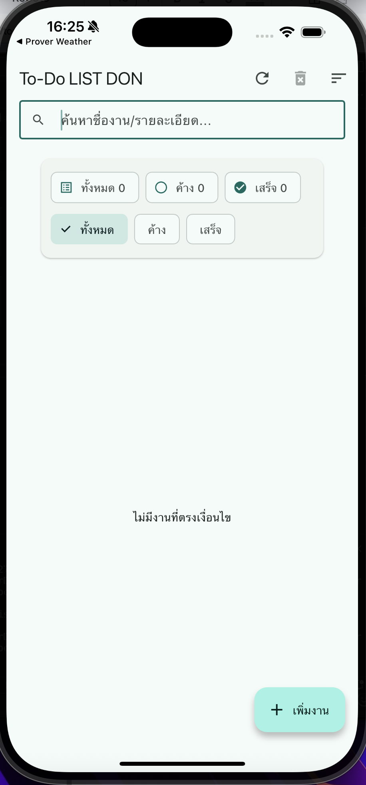
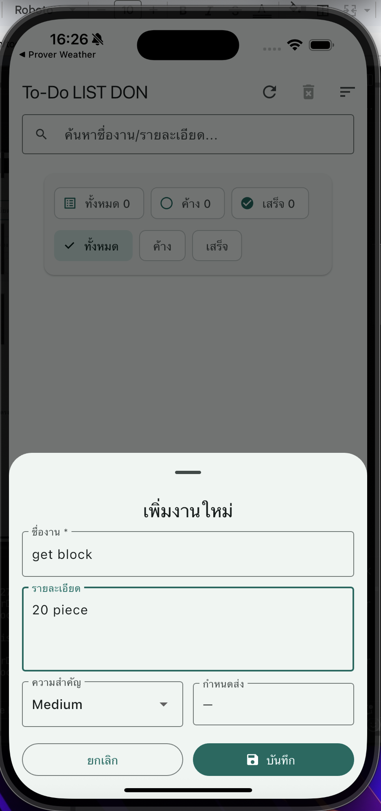
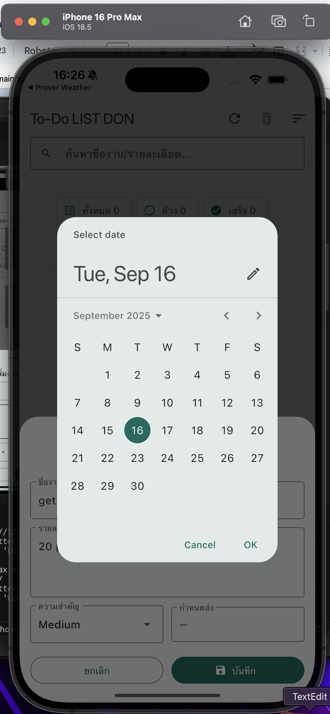
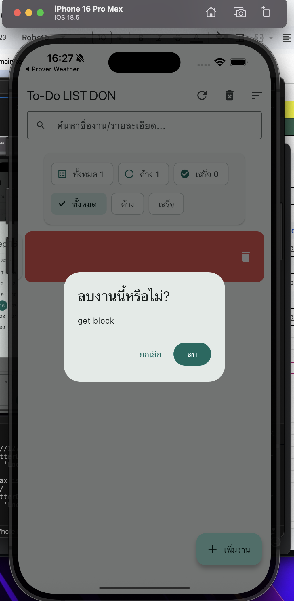
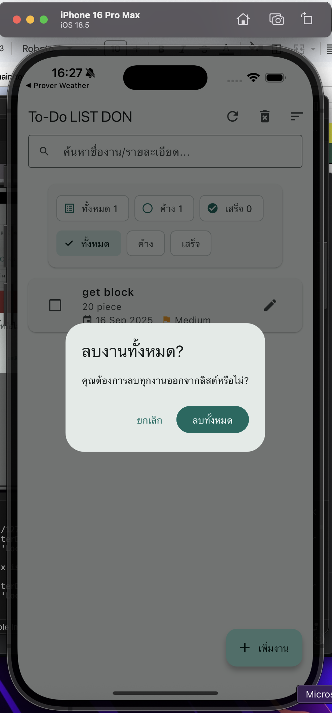
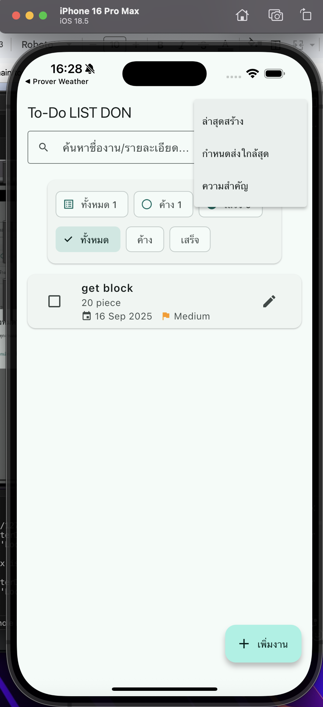

# 📋 To-Do Pro App (Flutter + Provider + SQLite)

แอปจัดการงาน (To-Do List) ที่พัฒนาด้วย **Flutter**, ใช้ **Provider** จัดการ state และบันทึกข้อมูลลง **SQLite** ผ่าน `sqflite` package  
รองรับการเพิ่ม แก้ไข ค้นหา จัดลำดับความสำคัญ และลบงานได้  

---

## 🚀 ฟีเจอร์หลัก
- เพิ่ม / แก้ไข / ลบงาน
- กำหนดรายละเอียด + วันครบกำหนด (Due Date)
- จัดลำดับความสำคัญ (High / Medium / Low)
- ค้นหาด้วย keyword
- Filter งาน (ทั้งหมด / ค้าง / เสร็จแล้ว)
- เรียงตามวันที่สร้าง, วันครบกำหนด, หรือความสำคัญ
- ลบงานทั้งหมดในครั้งเดียว
- ข้อมูลบันทึกถาวรด้วย SQLite

---

## 🛠️ ขั้นตอนการพัฒนา

### 1. ศึกษา API และ SQLite
- ใช้ **sqflite** จัดการฐานข้อมูล SQLite
- ใช้ **path_provider** หา path ของฐานข้อมูล
- สร้างตาราง `todos` มี column:
  - `id`, `title`, `description`, `due_date`, `priority`, `is_done`, `created_at`

### 2. การสร้าง Model
ไฟล์ [`lib/models/todo.dart`](lib/models/todo.dart)  
```dart
class Todo {
  final int? id;
  String title;
  String? description;
  DateTime? dueDate;
  int priority; // 1=High, 2=Medium, 3=Low
  bool isDone;
  DateTime createdAt;

  // แปลงเป็น Map (บันทึก DB)
  Map<String, dynamic> toMap() { ... }

  // สร้างจาก Map (อ่าน DB)
  factory Todo.fromMap(Map<String, dynamic> map) { ... }

  // clone object + แก้ไขค่า
  Todo copyWith({...}) { ... }
}
3. หลักการใช้งาน http และ provider
http ใช้ในโปรเจกต์อื่นได้ (เช่นดึง API ภายนอก)

provider ใช้เพื่อ:

จัดการ state ของ list งาน

สื่อสารระหว่าง widget และ database

4. Provider (State Management)
ไฟล์ lib/providers/todo_provider.dart

โหลดงานจาก DB → loadTodos()

เพิ่มงาน → addTodo()

อัพเดตงาน → editTodo()

toggle เสร็จ/ไม่เสร็จ → toggleDone()

ลบงาน → deleteTodo()

ลบทั้งหมด → clearAll()

กรอง/เรียง/ค้นหา → setFilter, setSort, setQuery

5. Database Service
ไฟล์ lib/services/todo_db.dart

เปิด DB ด้วย sqflite

มี CRUD: insert, query, update, delete

รองรับการอัปเกรด schema (version 2 เพิ่ม description, due_date ฯลฯ)

6. ออกแบบ UI
ไฟล์ lib/screens/home_screen.dart

AppBar: ปุ่มรีโหลด, ลบทั้งหมด, เรียงลำดับ

Search bar: พิมพ์เพื่อค้นหา

Filter chip: เลือกดูงาน (ทั้งหมด/ค้าง/เสร็จ)

ListView: แสดงงานแต่ละรายการ

Dismissible: ปัดซ้ายเพื่อลบ

FAB: ปุ่มเพิ่มงาน

BottomSheet Editor: แบบฟอร์มเพิ่ม/แก้ไขงาน

7. Main Entry
ไฟล์ lib/main.dart

dart
Copy code
void main() {
  runApp(
    ChangeNotifierProvider(
      create: (_) => TodoProvider()..loadTodos(),
      child: const MyApp(),
    ),
  );
}
📸 Screenshot ผลลัพท์ 
<br>

หน้าแรกของแอพ
<br>

กดปุ่มเพิ่มงาน
<br>

สามารถเลือกวันส่งงานได้
<br>

ปัดไปทางซ้ายเพื่อลบงาน
<br>

กดปุ่มถังขยะเพื่อลบงานทั้งหมด
<br>

กด hamburger menu เพื่อดูรายการ ล่าสุด,กำหนดส่งใกล้สุด,ความสำคัญงาน
markdown
Copy code

📦 การติดตั้งและรัน
bash
Copy code
# Clone โปรเจกต์
git clone <repo-url>
cd todo_app

# ติดตั้ง dependency
flutter pub get

# รันบน emulator/device
flutter run
🧑‍💻 โครงสร้างไฟล์
bash
Copy code
lib/
 ├── main.dart                # Entry point
 ├── models/todo.dart         # Todo model
 ├── providers/todo_provider.dart # State management
 ├── services/todo_db.dart    # Database service (SQLite)
 └── screens/home_screen.dart # UI หลัก
📚 เทคโนโลยีที่ใช้
Flutter

Provider

sqflite

intl (จัดรูปแบบวันที่)

📄 License
MIT

yaml
Copy code

---

คุณอยากให้ผมทำโฟลเดอร์ `screenshots/` พร้อมใส่ **โค้ด Flutter capture หน้าจอ UI ตัวอย่าง** ให้ด้วยไหมครับ จะได้เอาภ